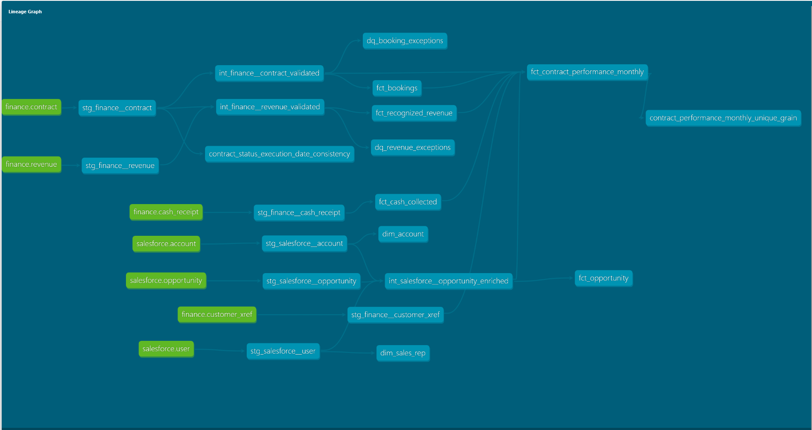

# Enterprise Analytics Platform | Snowflake + dbt

I built this project to demonstrate how I approach enterprise analytics architecture: start with the business question, establish clear ownership of the data, build the transformation layers, and make sure the numbers can actually be trusted before they reach a dashboard.

The project brings together synthetic **Salesforce CRM and Finance data** in Snowflake and uses dbt to create governed, BI-ready models for Bookings, Recognized Revenue, Cash Collected, Customers, Opportunities, and Sales Representatives.

The focus isn't just getting data from point A to point B. It's making sure there is a clear answer to questions like:

- Where did this number come from?
- What does it actually represent?
- What happens when the source data is wrong?
- Can Finance and Sales be reconciled?
- Can a BI user safely aggregate the data without accidentally doubling a metric?
- Who should have access to each layer?

> **Note:** All data in this repository is synthetic and was created specifically for this project. No proprietary or production company data is included.

---

## What I Built

The project follows a layered architecture:

```text
Salesforce                 Finance
    │                         │
    └──────────┬──────────────┘
               ▼
          RAW / LANDING
               │
               ▼
            STAGING
      Standardize + Test
               │
               ▼
          INTERMEDIATE
   Validate + Enrich + Apply
        Business Rules
               │
        ┌──────┴──────┐
        ▼             ▼
   GOVERNED MARTS   DQ EXCEPTIONS
        │
        ▼
    BI / ANALYTICS
```

The RAW layer represents data that could be landed by an ingestion platform such as Fivetran.

From there, dbt handles the transformation and governance work:

**Staging** standardizes the source data.

**Intermediate models** handle reusable business logic, validation, cross-system relationships, and enrichment.

**Marts** expose trusted facts and dimensions for reporting and analytics.

I kept those responsibilities separate intentionally. Business logic should not have to be recreated independently in every dashboard.

---

## The Business Scenario

I wanted the project to go beyond a basic Salesforce pipeline, so I added a Finance domain with:

- Contracts
- Revenue recognition
- Cash receipts
- Finance customer IDs

That creates a much more realistic enterprise problem.

Salesforce knows about the **customer and sales process**.

Finance knows about the **contract, recognized revenue, and cash**.

Those systems don't automatically speak the same language.

For example, Salesforce might know a customer as:

```text
ACC001
```

while Finance knows that same customer as:

```text
FIN-C001
```

I created a customer crosswalk that establishes a shared enterprise identity while retaining the original source-system identifiers:

```text
ACC001 + FIN-C001
        ↓
ACC001-FIN-C001
```

That gives us a common customer identity without destroying the lineage back to either system.

---

## Bookings ≠ Revenue ≠ Cash

One of the main design decisions in this project was keeping these three measures separate.

### Bookings

A booking occurs when a contract is executed.

The contract value belongs to the month in which that event occurred.

### Recognized Revenue

Revenue belongs to the accounting period in which Finance recognizes it.

That may happen over several months and does not necessarily line up with the booking date.

### Cash Collected

Cash belongs to the date the payment was actually received.

Again, that can happen at a completely different time.

So instead of treating all three as variations of the same metric, I modeled them independently and then brought them together at a controlled analytical grain.

---

## The Main Analytics Mart

The primary cross-functional model is:

`fct_contract_performance_monthly`

The grain is:

> **One row per contract per reporting month**

For example:

```text
Contract   Month      Bookings   Revenue   Cash
-------------------------------------------------
CON-1003   Mar-2026   400,000    100,000   200,000
CON-1003   Apr-2026         0    100,000         0
CON-1003   May-2026         0    100,000   100,000
```

This was important to me because I wanted the resulting dataset to behave correctly in a BI tool.

The $400,000 booking occurred in March, so it appears **once in March**.

I did not carry that $400,000 forward into April and May just because the contract continued generating revenue. Doing that would inflate the booking metric when someone summed the data across a quarter or year.

Each financial stream is first aggregated to the correct contract/month grain and then joined together.

That makes Bookings, Recognized Revenue, and Cash Collected additive and safe for downstream analysis.

---

## Keeping the Data Flexible

I intentionally did not build this as a single pre-aggregated executive KPI table.

The monthly mart retains useful analytical dimensions including customer, opportunity, sales representative, contract, and reporting month.

That means a BI consumer can aggregate upward rather than being limited to one predefined view.

For example, the same governed dataset can support analysis by:

- Month, quarter, or year
- Customer
- Industry
- Account type
- Opportunity
- Sales representative
- Contract

The business logic stays centralized while the reporting layer remains flexible.

---

## What Happens When the Data Is Wrong?

I deliberately put bad records into the synthetic source data because a pipeline where every source record is perfect doesn't demonstrate much about governance.

Two examples are included:

**1. A pending contract with an execution date**

Those two facts contradict each other.

**2. Revenue tied to a contract that doesn't exist**

That creates an orphaned Finance transaction.

I don't silently delete either record.

Instead, the project follows this pattern:

```text
Detect
  ↓
Classify
  ↓
Quarantine
  ↓
Expose for investigation
  ↓
Allow valid data to continue
```

The questionable records are excluded from the governed KPI models but remain available in:

- `dq_booking_exceptions`
- `dq_revenue_exceptions`

This gives the business trustworthy reporting without making the underlying data problem disappear.

---

## Not Every Missing Relationship Is Bad Data

I also wanted to distinguish an actual data-quality problem from a legitimate business scenario.

One Finance contract intentionally has **no Salesforce Opportunity**.

That isn't automatically an error. A contract could originate outside the CRM workflow.

For that reason, the final mart uses LEFT JOINs when adding Salesforce enrichment.

The Finance transaction survives even when CRM information isn't available.

I also expose a `customer_mapping_status` so unmapped records can be identified and investigated rather than silently dropped.

---

## Models

### Salesforce Staging

- `stg_salesforce__account`
- `stg_salesforce__opportunity`
- `stg_salesforce__user`

### Finance Staging

- `stg_finance__contract`
- `stg_finance__revenue`
- `stg_finance__cash_receipt`
- `stg_finance__customer_xref`

### Intermediate

- `int_salesforce__opportunity_enriched`
- `int_finance__contract_validated`
- `int_finance__revenue_validated`

### Governed Marts

- `dim_account`
- `dim_sales_rep`
- `fct_opportunity`
- `fct_bookings`
- `fct_recognized_revenue`
- `fct_cash_collected`
- `fct_contract_performance_monthly`

### Data Quality

- `dq_booking_exceptions`
- `dq_revenue_exceptions`

---

## Testing and Governance

The project currently contains:

- **19 dbt models**
- **56 automated data tests**
- **7 governed sources**

Tests cover things such as:

- Required fields
- Unique identifiers
- Accepted business values
- Referential integrity
- Salesforce Account and Sales Rep relationships
- Finance Contract relationships
- Cross-system customer mappings
- Revenue-to-Contract reconciliation
- Contract status consistency
- Contract/month grain

The current full build result is:

```text
PASS=73
WARN=2
ERROR=0
TOTAL=75
```

The two warnings are intentional.

They represent the two synthetic records that violate our business rules and are routed through the exception-handling process.

I chose warnings rather than pipeline-stopping errors because those records are quarantined and do not contaminate the governed KPIs.

---

## Reconciliation

After building the final monthly mart, I reconciled the output back to the valid source activity.

| Reporting Month | Bookings | Recognized Revenue | Cash Collected |
|---|---:|---:|---:|
| Jan 2026 | $125,000 | $25,000 | $50,000 |
| Feb 2026 | $250,000 | $125,000 | $125,000 |
| Mar 2026 | $750,000 | $300,000 | $275,000 |
| Apr 2026 | $325,000 | $250,000 | $300,000 |
| May 2026 | $0 | $200,000 | $100,000 |
| **Total** | **$1,450,000** | **$900,000** | **$850,000** |

The quarantined $180,000 pending contract is not included in Bookings.

The orphaned $50,000 revenue record is not included in Recognized Revenue.

Both remain visible in the data-quality layer.

---

## dbt Lineage



dbt `source()` and `ref()` dependencies provide traceability from the source layer through transformation and into the final analytical models.

This also makes downstream impact much easier to understand when a model or source changes.

---

## Snowflake Structure

```text
RAW
├── SALESFORCE
│   ├── ACCOUNT
│   ├── OPPORTUNITY
│   └── USER
│
└── FINANCE
    ├── CONTRACT
    ├── REVENUE
    ├── CASH_RECEIPT
    └── CUSTOMER_XREF


ANALYTICS
├── STAGING
├── INTERMEDIATE
└── MARTS
```

The access model separates responsibilities:

- Ingestion owns the RAW landing layer.
- dbt reads RAW and builds governed analytics models.
- BI consumers receive read-only access to curated MARTS.

The goal is to keep transformation and metric logic centralized rather than burying different versions of the same calculation inside individual reports.

---

## Technology

- Snowflake
- dbt Core
- SQL
- YAML
- Git / GitHub
- Visual Studio Code
- PowerShell
- Python virtual environment

The architecture is designed to work with ingestion tools such as **Fivetran** and downstream BI platforms such as **Tableau**.

For this portfolio project, those integrations are represented architecturally rather than connected to production systems.

---

## Development Workflow

I use feature branches for changes, validate the project through dbt builds and automated tests, and merge changes through pull requests rather than developing directly against `main`.

For me, the goal of the project isn't simply to demonstrate that I can write dbt models.

It's to demonstrate how I think about the larger analytics environment: **data ownership, grain, business definitions, cross-system relationships, governance, quality, lineage, security, and how the data will actually behave when someone starts using it for decisions.**